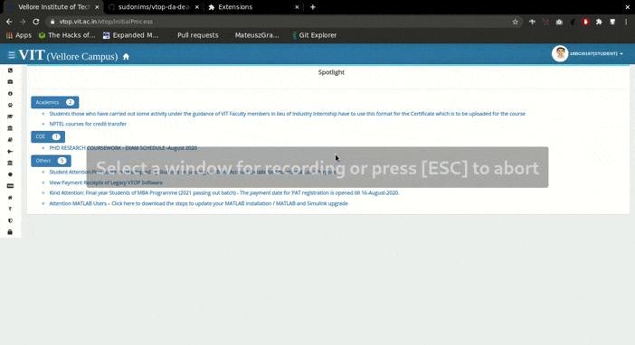

## Directions to use
    1) Clone the project
    2) Load the unpacked chrome extension
    3) Go to vtop DA section
    4) Click anywhere on the blank screen (has an 'click' event listener)
    5) See the deadline of all the upcoming DAs with download link if any.

## Example
   
   
